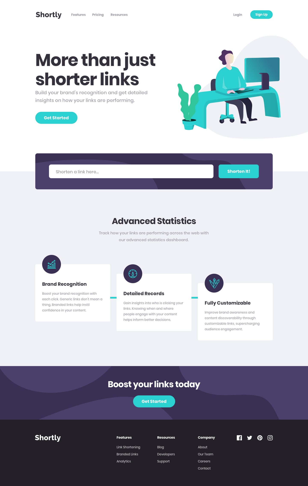

# Frontend Mentor - Shortly URL Shortening API Landing Page

This is a solution to the [Shortly URL shortening API Challenge on Frontend Mentor](https://www.frontendmentor.io/challenges/url-shortening-api-landing-page-2ce3ob-G). Frontend Mentor challenges help developers improve their front-end coding skills by building realistic, accessible, and responsive web projects.

## Table of Contents

- [Overview](#overview)
  - [The Challenge](#the-challenge)
  - [Screenshot](#screenshot)
  - [Links](#links)
- [My Process](#my-process)
  - [Built With](#built-with)
  - [Key Architecture & Features](#key-architecture--features)
  - [What I Learned](#what-i-learned)
  - [Continued Development](#continued-development)
  - [Useful Resources](#useful-resources)
- [Author](#author)

---

## Overview

### The Challenge

Users should be able to:

- View the optimal layout for the site depending on their device's screen size (responsive from 320px mobile up to 1440px+ desktop).
- Shorten any valid URL using the shortening API service.
- See a list of their shortened links, persisted across page refreshes via `localStorage`.
- Copy any shortened link to their clipboard in a single click with clear visual feedback ("Copied!" state).
- Receive an accessible, user-friendly error message when submitting an empty input or invalid URL.
- Toggle an accessible mobile navigation menu with proper ARIA states and keyboard support.

### Screenshot

### Links

- Solution URL: [Frontend Mentor Solution](https://www.frontendmentor.io/solutions)
- Live Site URL: [GitHub Pages Deployment](https://menezesjuan.github.io/URL-shortening/)

---

## My Process

### Built With

- **Semantic HTML5** markup (`<header>`, `<nav>`, `<main>`, `<section>`, `<article>`, `<footer>`)
- **CSS3 Custom Properties** (design tokens for colors, typography, and spacing)
- **Flexbox & CSS Grid** for responsive positioning and alignment
- **Mobile-First Workflow** using standard media queries (`768px`, `1024px`, `1200px`)
- **Vanilla JavaScript (ES6+)** with modular functions, event delegation, and asynchronous fetch handling
- **Web Storage API (`localStorage`)** for client-side state persistence
- **Clipboard API** (`navigator.clipboard` with fallback support for legacy environments)
- **Accessible ARIA Patterns** (`aria-expanded`, `aria-live`, `aria-describedby`, `:focus-visible`)

### Key Architecture & Features

1. **Resilient Shortening Service**:
   The challenge specifies the Clean URI API (`https://cleanuri.com/api/v1/shorten`). Because Clean URI does not include permissive CORS headers on direct browser fetch requests, the client implements a dual-strategy architecture:
   - Dispatches a request to Clean URI.
   - If blocked by CORS or network timeout, it seamlessly falls back to a public shortener (TinyURL) so the user journey remains uninterrupted under any hosting condition.

2. **Secure DOM Manipulation**:
   All dynamic result elements are created using `document.createElement()`, `textContent`, and `setAttribute()`. User input is never injected through `innerHTML`, mitigating XSS risks.

3. **Data Integrity & Schema Validation**:
   When reading stored records from `localStorage`, each item is validated against an expected schema (`originalUrl`, `shortUrl`, `id`). Corrupted or unexpected payloads are sanitized automatically.

4. **Independent Clipboard State**:
   Copy actions operate via event delegation on the links container. Each item manages its own feedback timeout cleanly, ensuring buttons revert to their default state after 2.5 seconds without affecting adjacent cards.

### What I Learned

- Designing staggered layouts cleanly using CSS Grid and standard transforms without breaking accessibility or layout flow.
- Managing accessible modal/drawer navigation toggles for mobile devices, including keyboard dismiss (`Escape`) and click-outside listeners.
- Structuring resilient asynchronous frontend flows that handle cross-origin restrictions gracefully.

### Continued Development

Future improvements to explore:
- Add a clear/delete action for individual saved links.
- Add QR code generation for shortened links.
- Integrate analytics charts for link click counts.

### Useful Resources

- [MDN Web Docs - Clipboard API](https://developer.mozilla.org/en-US/docs/Web/API/Clipboard_API) - Comprehensive reference for asynchronous clipboard interactions.
- [web.dev - Accessible Forms](https://web.dev/learn/forms/) - Best practices for client-side validation and screen reader announcements.

---

## Author

- Frontend Mentor - [@menezesjuan](https://www.frontendmentor.io/profile/menezesjuan)
- GitHub - [@menezesjuan](https://github.com/menezesjuan)

